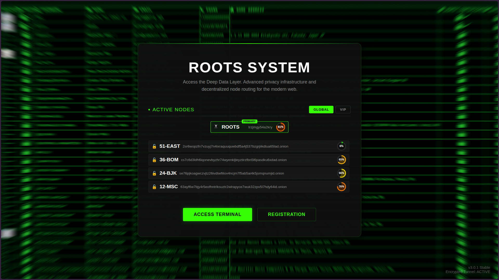

# 🌱 ROOTS


> Professional subscription-based data & file management platform built with pure PHP.

ROOTS is a full-featured web application that combines user subscriptions, a points-based economy, purchase record management, an admin control panel, and a Drone Face Scanner API — all built on a modern, namespaced PHP architecture.

<p align="center">
  
  <br>
  <em>ROOTS — welcome & dashboard experience</em>
</p>

---

## 🧅 Onion Services

The platform auto-detects `.onion` hosts and adjusts its security policy accordingly. The original production version is also reachable via Tor:

| Network | Address |
|---------|---------|
| 🌐 Clearnet | `https://your-domain.com` |
| 🧅 Tor / Onion | `http://REPLACE_WITH_YOUR_ONION_ADDRESS.onion` |
| 🧅 Tor (Mirror) | `http://REPLACE_WITH_YOUR_MIRROR_ONION_ADDRESS.onion` |

> ⚠️ Replace the placeholder `.onion` addresses above with your real v3 onion addresses before publishing.

---

## ✨ Features

### 👤 User Accounts & Authentication
- Secure sign-up and login with CAPTCHA protection (`gregwar/captcha`)
- Session management and account security guard
- Ban / suspension system with automatic redirect to blocked pages
- Password change & account recovery flows

### 💎 Subscription Plans
- Four tiers: **Free**, **Basic**, **Pro**, **Premium**
- Shared plan catalog rendered as spec cards (`includes/plan-catalog.php`)
- Feature-gated access: database access, storage caps, API access, concurrent sessions, privacy tiers

### 💰 Points & Wallet Economy
- Buy points and transfer points between users (1,000 – 1,000,000 per transfer)
- Full transaction history with financial analytics (total earned / spent)
- BTC withdrawals with live price estimation (CoinGecko) and mixer-style fee calculation
- Withdrawal requests managed from the admin panel

### 📁 Purchase & Record Management
- Add, edit, view, cancel and delete purchase records
- Password purchase database (`password_db.php`) with admin upload flow
- Purchase status tracking and detailed record views

### 🛡️ Admin Panel
- Payments, withdrawals, and pending request management
- Security guard — ban / suspend users
- Password uploads and professional admin dashboard

### 🔐 Security
- CSRF tokens on all state-changing forms
- Content-Security-Policy, HSTS, X-Frame-Options and hard security headers
- Automatic `.onion` service detection with adjusted CSP policy
- Security audit & rate-limiting utilities

### 🤖 Drone Face Scanner API
- REST API for drone face detection & recognition (OpenCV-based)
- API key + secret authentication, tier-based rate limiting
- AES-256-GCM encryption for sensitive data
- Full documentation: [`docs/drone-api-documentation.md`](docs/drone-api-documentation.md)


## 📑 Table of Contents

- [Features](#-features)
- [Onion Services](#-onion-services)
- [Tech Stack](#-tech-stack)
- [Project Structure](#-project-structure)
- [Getting Started](#-getting-started)
- [Documentation](#-documentation)
- [Development](#-development)
- [Disclaimer](#️-disclaimer)
- [License](#-license)

---

## 🧱 Tech Stack

| Layer      | Technology |
|------------|------------|
| Language   | PHP >= 8.1 |
| Database   | MySQL (MySQLi) |
| Packages   | Composer — `gregwar/captcha`, `php-mcp/server` |
| Dev tools  | PHPStan, PHPUnit |
| Frontend   | HTML/CSS/JS (Bootstrap), terminal-themed UI |

---

## 📂 Project Structure

```
├── api/                # API endpoints
├── assets/  css/  js/  img/  scss/   # Static assets
├── Captcha/            # CAPTCHA assets
├── config/             # Configuration
├── docs/               # Documentation (Drone API)
├── includes/           # Shared view helpers (plan catalog, etc.)
├── lib/                # Third-party libraries
├── scripts/            # Utility scripts
├── src/                # PSR-4 "ROOTS\" namespaced classes
│   ├── Auth/           # Session & authentication
│   ├── Config/         # Database configuration
│   ├── Controllers/    # Page controllers
│   ├── Database/       # DB layer
│   ├── Drone/          # Drone scanner API (client, services…)
│   ├── ErrorHandling/  # Error/exception handling
│   ├── Layout/         # Layout rendering
│   ├── Middleware/     # Request middleware
│   ├── Routing/        # Router (clean URLs)
│   ├── Security/       # CSRF, headers, guards
│   ├── Services/       # Business services
│   ├── Terminal/       # Terminal UI components
│   ├── Utils/          # Helpers
│   └── Validation/     # Input validation
├── uploads/            # User uploads
├── index.php           # Entry point (301 → /dashboard)
├── router.php          # Clean-URL router
└── composer.json
```

---

## 🚀 Getting Started

### Requirements
- PHP **8.1+** with mysqli extension
- MySQL / MariaDB
- Composer
- Web server with rewrite support (Apache/Nginx) for clean URLs

### Installation

```bash
# 1. Clone the repository
git clone https://github.com/12730d/roots.git
cd roots

# 2. Install dependencies
composer install

# 3. Configure the database
#    Edit db_config.php / config files with your DB credentials,
#    then import your schema (tables: users, transaction_history,
#    withdrawals, user_security_guard, purchase records, …)

# 4. Point your web server document root to the project directory
#    and route all requests through router.php for clean URLs.
```

### Configuration
- Database credentials: `db_config.php` / `src/Config/`
- App-wide settings: `config.php`
- Ensure `uploads/` is writable by the web server

---

## 📖 Documentation

- **Drone Face Scanner API** — full reference with endpoints, auth, rate limits and SDK examples: [`docs/drone-api-documentation.md`](docs/drone-api-documentation.md)

---

## 🧪 Development

```bash
# Static analysis
vendor/bin/phpstan analyse

# Tests
vendor/bin/phpunit
```

---

## ⚠️ Disclaimer

This project is provided for educational and development purposes. You are responsible for complying with all applicable laws and regulations (including data-protection laws such as GDPR) when deploying or operating it.

---

## 📄 License

Proprietary — see `composer.json`. All rights reserved.

---

<p align="center">🌱 <b>ROOTS</b> — grow your data platform from the root.</p>
